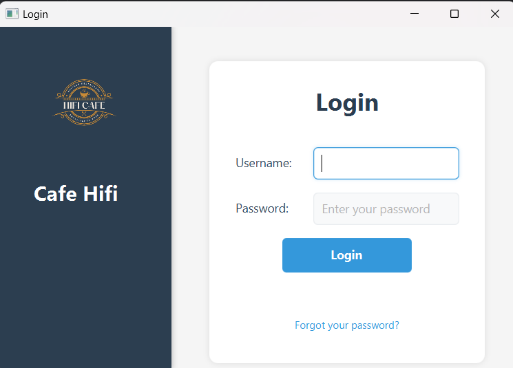
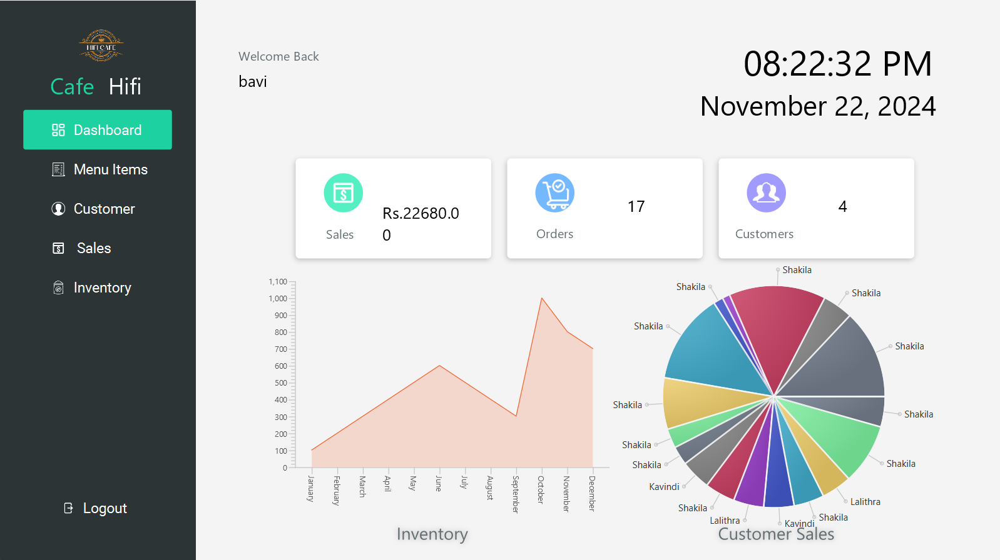
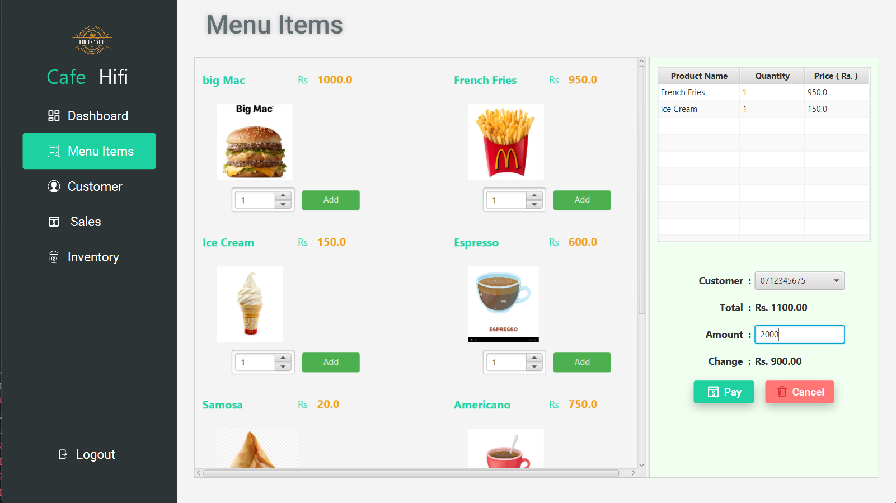
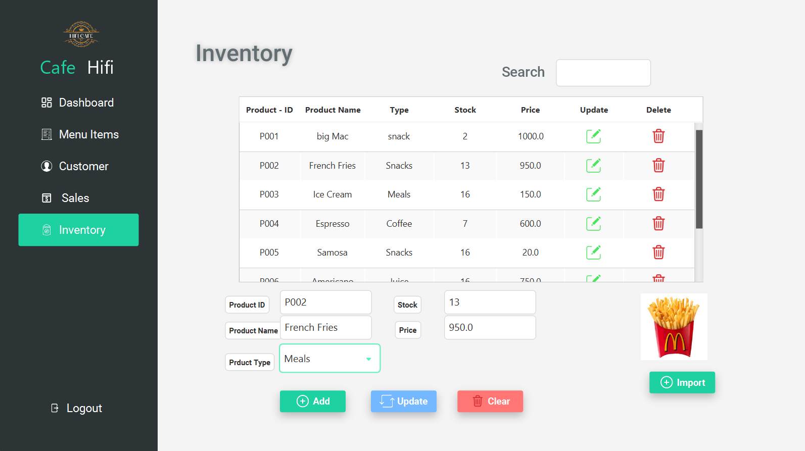
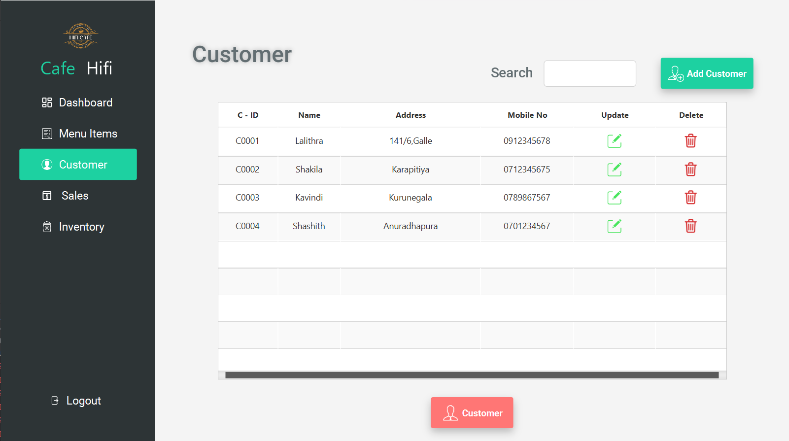
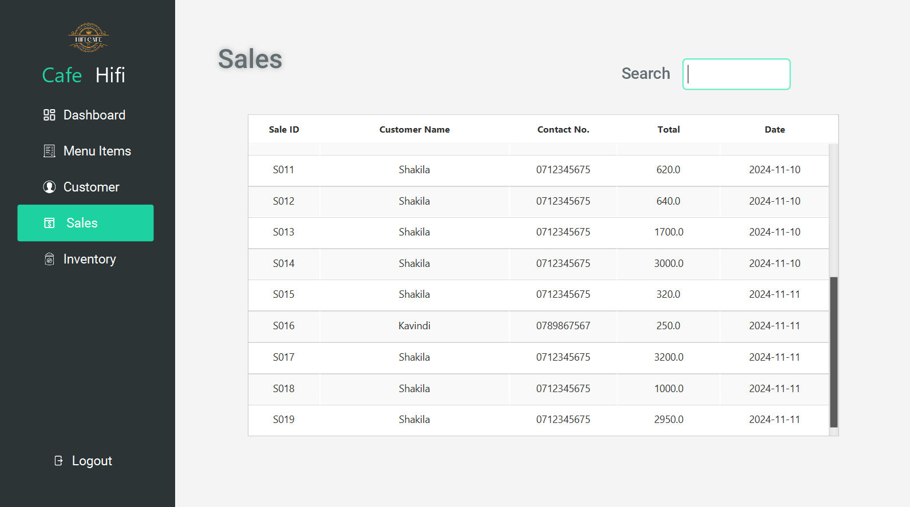

# Cafe Hifi Management System

The **Cafe Hifi Management System** is a comprehensive JavaFX application built to manage cafe operations efficiently. This project demonstrates key programming concepts, such as UI design with FXML, database integration using MySQL, and CRUD (Create, Read, Update, Delete) functionalities.

Whether you're managing employees or products, this system simplifies the process, offering a user-friendly interface and robust backend functionality.

## Features

### Employee Management
- **Add** new employees to the system.
- **Edit** existing employee information.
- **Remove** employees when no longer needed.

### Product Management
- **Add and update** product details, such as price and stock.
- **View** all products in an organized table view.

### Additional Highlights
- Interactive UI built with **JavaFX** and styled using **CSS**.
- Integration with **MySQL** for secure and efficient data storage.
- Easy-to-navigate application design tailored for small cafes.

## Screenshots

### Login View

### Dashboard View

### Menu View

### Employee Management

### Sales View

### Customer Management

## Project Overview

The system is developed using:
- **JavaFX** for creating an interactive and visually appealing user interface.
- **MySQL** for handling the backend database.
- **FXML** and **CSS** for UI customization and structure.

The project includes modularized code for easy understanding and adaptability, making it an excellent learning resource for beginner to intermediate developers.
